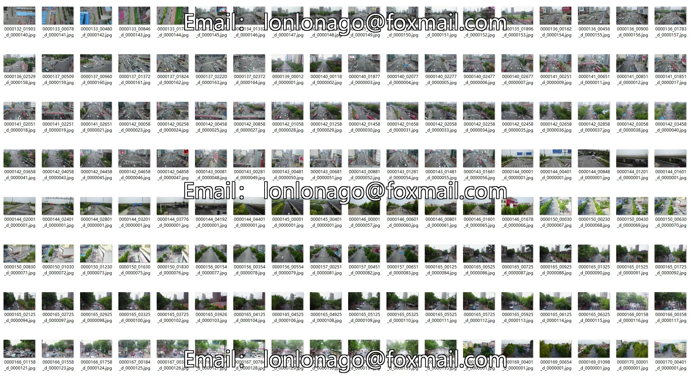
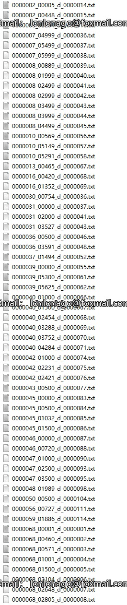
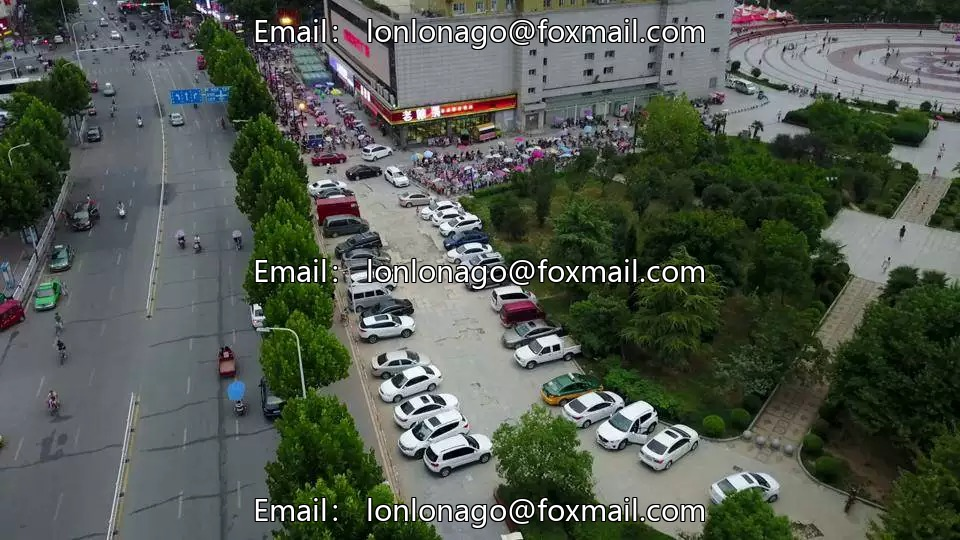
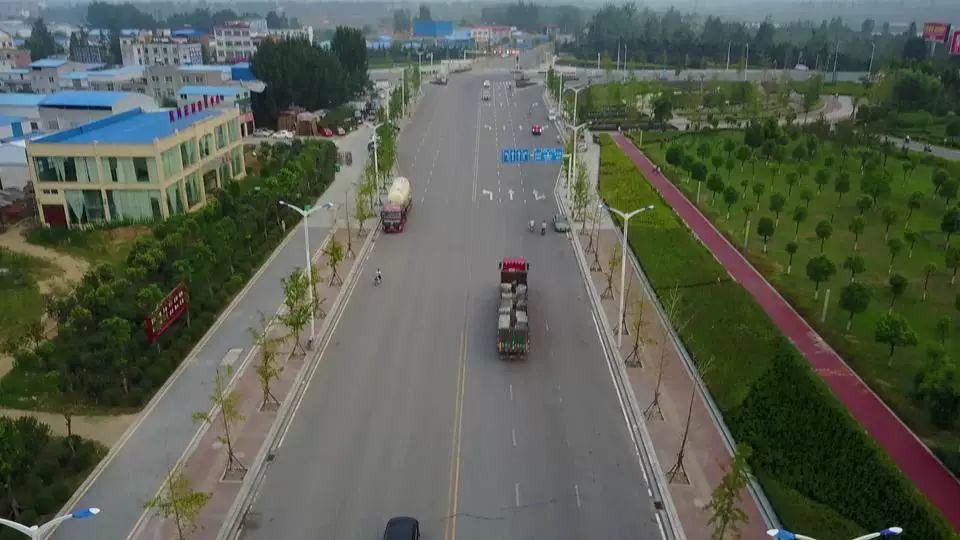
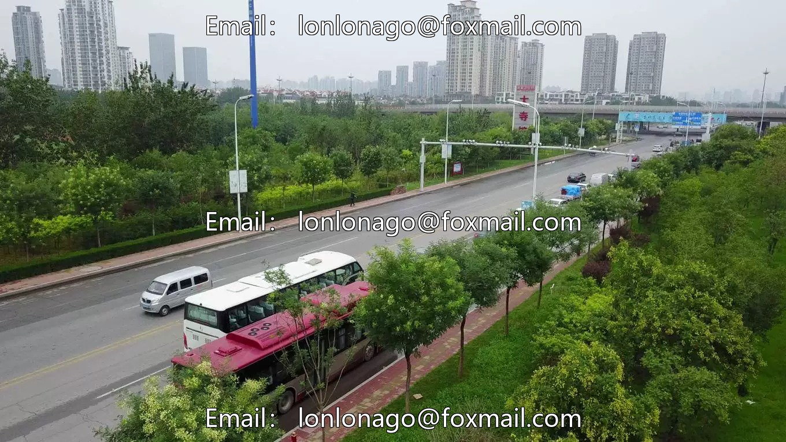
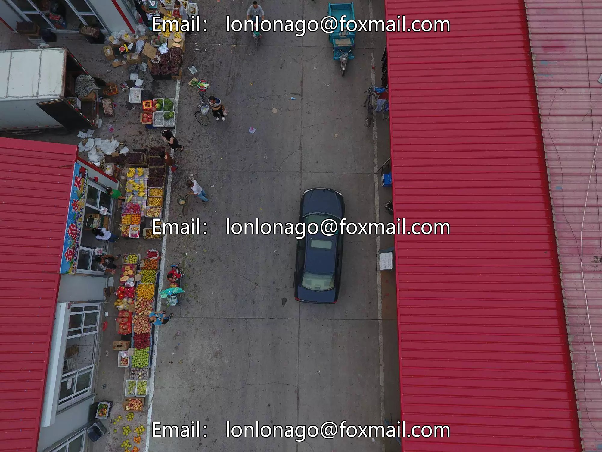

## Body

UAV Vision Object Detection Standard Dataset

Totally 10,209 images, labeled with tags.
Divided into 10 categories, including:
pedestrian (行人) person (人群 / 个体，some versions merged as pedestrian) car (轿车) van (厢式货车) bus (公交) truck (卡车) motor (摩托车) bicycle (自行车) awning-tricycle (带篷三轮车) tricycle (三轮车)

The dataset is divided into 4 parts: trainset (training set), valset (validation set), testset-dev (development test set, with annotations, can be published in papers), testset-challenge (competition test set, without annotations, for competition).

All collected by real UAV aerial photography, with strong characteristics: from 14 different cities in China, spanning thousands of kilometers.
Scenes: city streets, rural areas, campuses, intersections, squares.
Viewpoints: oblique views, close-up, distant view, all available.
Weather: sunny, overcast, evening, weak light.
Density: sparse crowds / traffic flow, extremely crowded scenes.
Objects: varying sizes, severe occlusions, diverse poses.

The most commonly used standard dataset for UAV vision direction.

Electronic virtual products sold are not returnable.

## Images

Here is a pay link on Stripe ( https://buy.stripe.com/3cs8yP7sY87d0vu9AB ). Please contact me lonlonago@foxmail.com after funding $89, and I will send you a complete data files , thank you!

